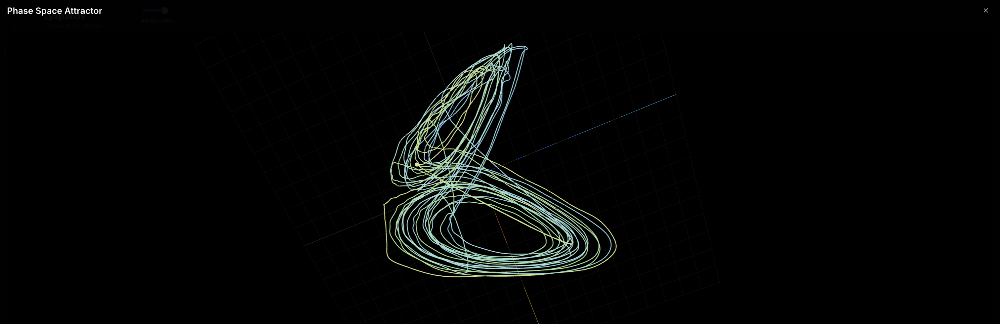
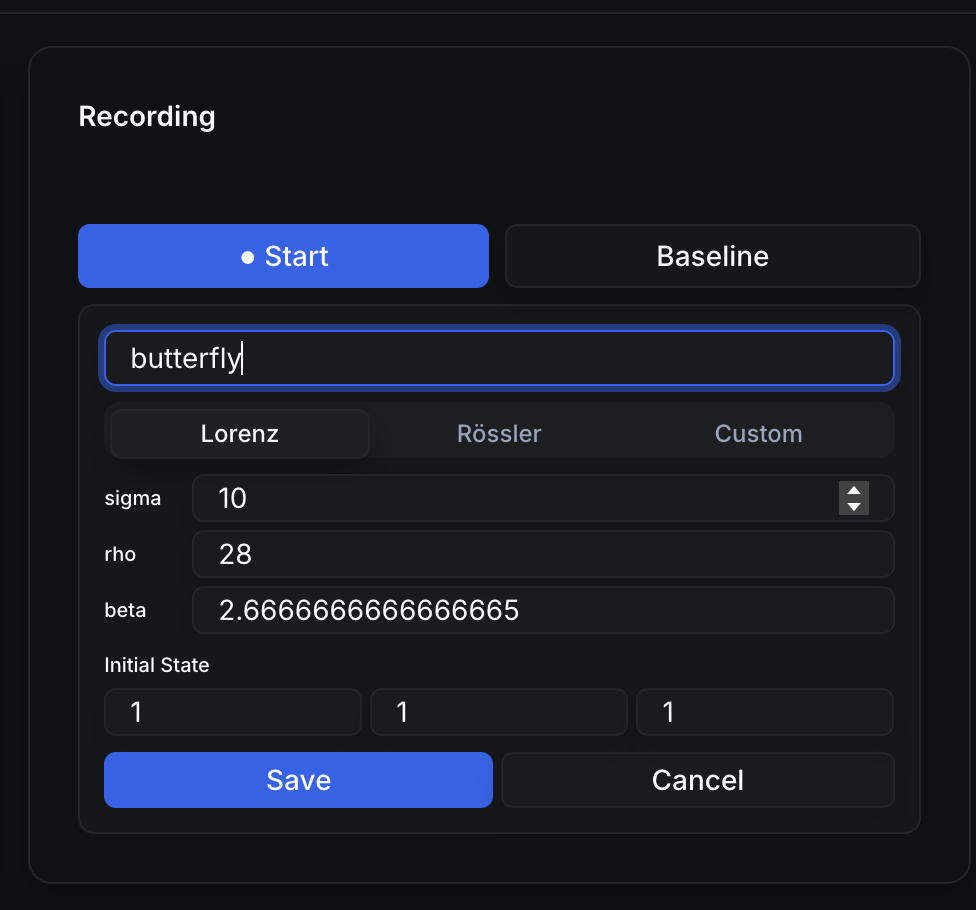
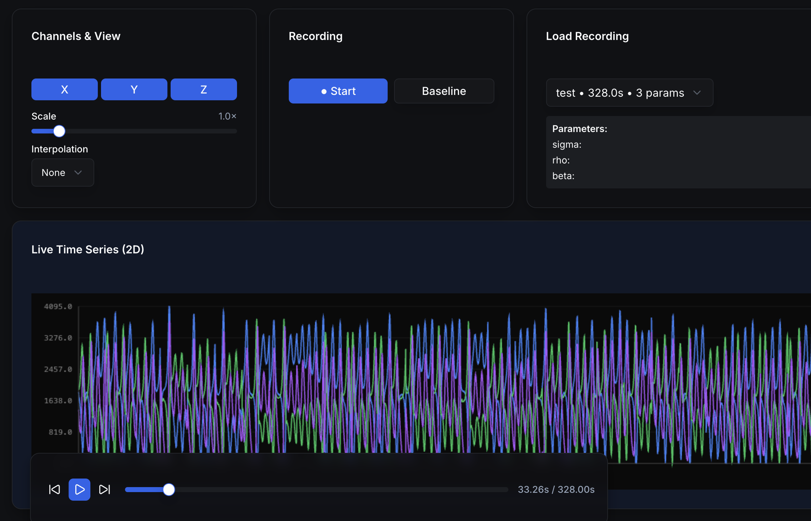
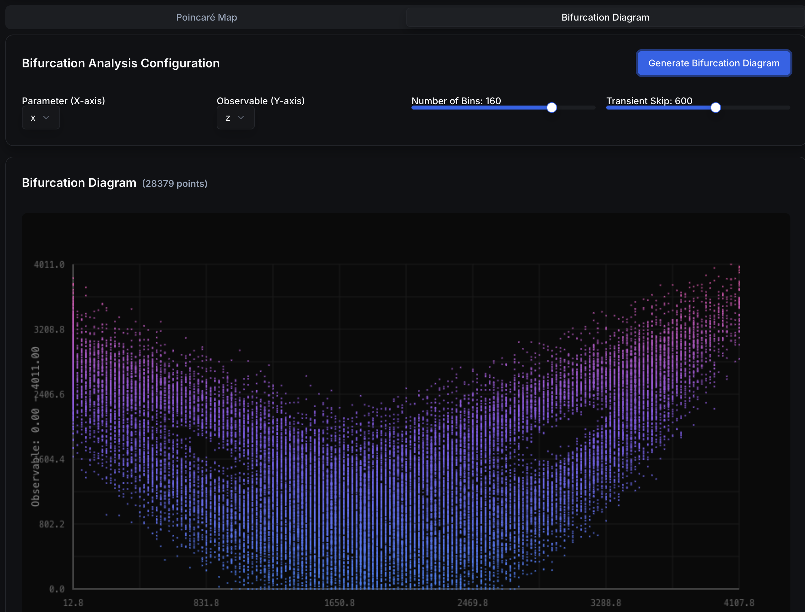
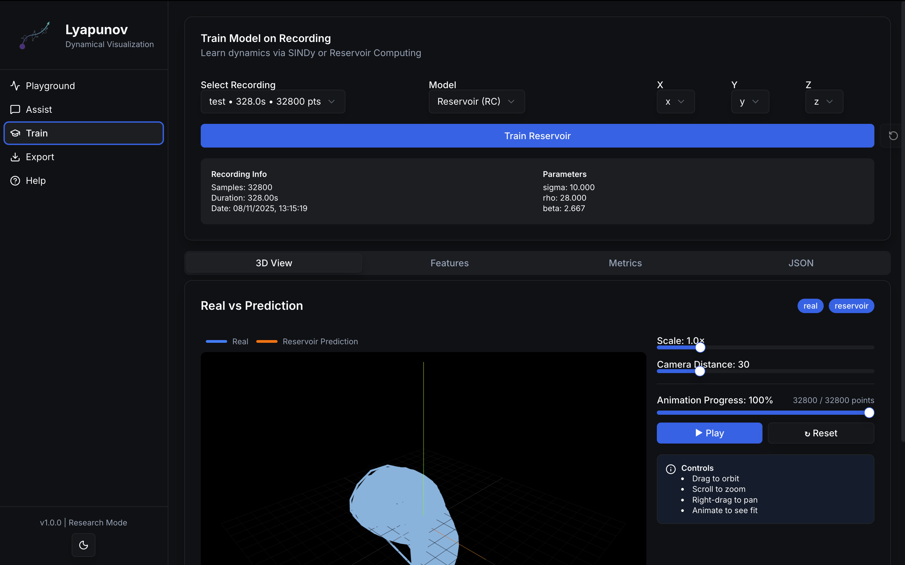
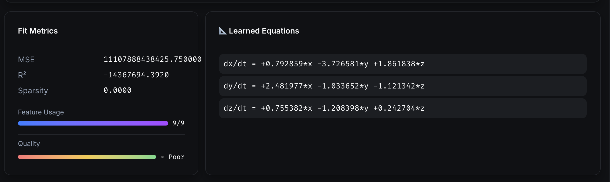

# Lyapunov Dashboard — User Guide (GitHub)


A realtime, interactive dashboard for exploring nonlinear dynamics, recording multichannel time series, and training models (SINDy / Reservoir Computing). This GitHub-facing guide focuses on **getting started**, **CLI usage**, **configuration**, and a **feature‑by‑feature walkthrough with images**.

> **Version:** 1.0 · **Last updated:** {{ git_revision_date_localized or "—" }}

<br clear="both"/>

---

## 0) TL;DR Quickstart

```bash
# Install the Python package
pip install lyapunov-lab

# Launch the app (CLI)
lyapunov-lab start
```

- Opens the dashboard locally with sensible defaults.
- For remote/container deployments, see **Configuration** below.

---

## 1) CLI Reference

The package exposes a single top-level command with one option (port). The CLI boots the **FastAPI backend** (and serves the prebuilt frontend if available).

```bash
# Start the backend (FastAPI via uvicorn)
lyapunov-lab start --port 3000

# Option details
--port  Port to run the backend server on (default: 3000)
```

Under the hood this launches:

```python
uvicorn lyapunov_lab.backend.app:app --host 0.0.0.0 --port <PORT>
```

> The frontend static build is auto-mounted at `/` if found at `lyapunov_lab/frontend/out`.

---

## 2) Configure the Frontend (WebSocket)

The dashboard consumes a live stream over WebSocket at **`/api/stream`** from the backend (same origin by default). If you deploy the frontend separately, point it to your backend origin.

Recommended snippet in your UI to allow env-based configuration:

```ts
// src/PlaygroundView.tsx
export const WS_URL =
  process.env.NEXT_PUBLIC_WS_URL ??
  (typeof window !== "undefined"
    ? `ws://${window.location.host}/api/stream`
    : "ws://localhost:3000/api/stream");
```

> Replace the file path/link to match your repo, e.g. [`src/PlaygroundView.tsx`](https://github.com/<org>/<repo>/blob/main/src/PlaygroundView.tsx).

---

## 3) Stream from Hardware (UDP → Server → WebSocket)

**UDP ingestion** → backend buffers the latest batch → pushes to all WebSocket clients at `/api/stream`.

- UDP listen address: `0.0.0.0:5005`
- Packet format: **JSON array** of objects with `x`, `y`, `z` (you can add `t`/`time`/`timestamp` too)

### 3.1 Microcontroller example (Wi‑Fi UDP)

```cpp
#include <WiFi.h>
#include <WiFiUdp.h>
#include <hardware/adc.h>
#include <pico/multicore.h>

// ====== USER CONFIG ======
const char* ssid       = "YOUR_SSID";
const char* password   = "YOUR_PASSWORD";
const char* destIP     = "YOUR_COMPUTER_IP";  // FastAPI host IP
const uint16_t destPort = 5005;               // UDP port FastAPI listens on
// ==========================

// Sampling config
const int NUM_SAMPLES  = 100;   // per batch
const int NUM_CHANNELS = 3;

volatile uint16_t sampleBuffer[NUM_CHANNELS][NUM_SAMPLES];
volatile bool bufferReady = false;

WiFiUDP udp;

// =========================================================
//                 CORE 1 → ADC SAMPLING
// =========================================================
void core1_adcTask() {
  adc_init();
  adc_gpio_init(26);  // CH0
  adc_gpio_init(27);  // CH1
  adc_gpio_init(28);  // CH2
  adc_set_clkdiv(0);  // fastest (~500 kS/s)

  while (true) {
    if (!bufferReady) {
      for (int i = 0; i < NUM_SAMPLES; i++) {
        for (int ch = 0; ch < NUM_CHANNELS; ch++) {
          adc_select_input(ch);
          sampleBuffer[ch][i] = adc_read();
        }
      }
      bufferReady = true;
    }
    tight_loop_contents();
  }
}

// =========================================================
//                 CORE 0 → Wi-Fi + UDP TX
// =========================================================
void connectWiFi() {
  WiFi.mode(WIFI_STA);
  WiFi.begin(ssid, password);
  Serial.print("Connecting to Wi-Fi");
  while (WiFi.status() != WL_CONNECTED) {
    delay(500);
    Serial.print(".");
  }
  Serial.println("\nConnected!");
  Serial.print("IP address: ");
  Serial.println(WiFi.localIP());
}

void setup() {
  Serial.begin(115200);
  delay(1000);

  connectWiFi();
  udp.begin(destPort);
  multicore_launch_core1(core1_adcTask);

  Serial.println("ADC sampling + JSON UDP streaming started...");
}

void loop() {
  if (!bufferReady) return;

  // Prepare JSON string batch
  String jsonData = "[";
  for (int i = 0; i < NUM_SAMPLES; i++) {
    jsonData += "{\"x\":";
    jsonData += sampleBuffer[0][i];
    jsonData += ",\"y\":";
    jsonData += sampleBuffer[1][i];
    jsonData += ",\"z\":";
    jsonData += sampleBuffer[2][i];
    jsonData += "}";
    if (i < NUM_SAMPLES - 1) jsonData += ",";
  }
  jsonData += "]";

  // Send over UDP
  udp.beginPacket(destIP, destPort);
  udp.print(jsonData);
  udp.endPacket();

  Serial.printf("Sent %d samples (%d bytes) to %s:%d\n",
                NUM_SAMPLES, jsonData.length(), destIP, destPort);

  bufferReady = false;
}
```

### 3.2 Desktop simulator (CSV → UDP)

Use the included helper to test without hardware:

```bash
python scripts/simulate_device.py \
  # expects CSV with columns: x,y,z
```

Key bits from `scripts/simulate_device.py`:

```python
UDP_IP = "127.0.0.1"   # change if FastAPI runs elsewhere
UDP_PORT = 5005         # must match backend
CSV_PATH = "scripts/logs/lorenz_sample_output.csv"
SEND_INTERVAL = 0.01
```

---

## 4) Feature‑by‑Feature Walkthrough (with Images)

> Place images under `docs/images/` (or adjust paths). Keep the single logo at top‑left.

### 4.1 Overview


_The main Playground exposes live plots, 3D phase‑space, recording, and playback controls._


### 4.2 Channels, Options & Lyapunov


- Toggle X / Y / Z channels
- Adjust Scale and Interpolation (none / linear / spline)
- Start/stop Recording; set Baseline
- Live Lyapunov exponent & state classifier _(Stable / Periodic / Quasi‑Periodic / Chaotic)_

### 4.3 Visualizations

**Time series (fullscreen)**

_Click the maximize button to expand to fullscreen._

**Phase‑space trajectory (fullscreen)**

_Orbit to rotate • scroll to zoom • right-drag to pan._

### 4.4 Recording & Playback





> Attach system parameters (e.g., Lorenz σ, ρ, β) and initial state.


Floating **Playback Controls** allow play/pause, skip, scrubbing. Timeline in seconds (assuming 100 Hz).

### 4.5 Analysis


_Visualizes qualitative regime changes (e.g., period-doubling routes to chaos)._


_Section crossings reveal periodic / quasi‑periodic / chaotic structure._

### 4.6 Training






---

## 5) Backend API (for Integrators)

**Base URL:** `http://<host>:<port>` (default port from CLI is `3000`)

### 5.1 Health

- `GET /api/health` → `{ status: "ok", sindy: <bool> }`

### 5.2 Live stream

- `WS /api/stream` → pushes `{ samples: [ {x,y,z,(t?)}... ], timestamp }`

### 5.3 Train SINDy

- `POST /api/sindy/train` → `SindyTrainResponse`

  - Accepts a `recording` (x,y,z time series) and `axes` mapping.
  - Uses **PySINDy** when available; falls back to linear model otherwise.
  - Returns equations, metrics (MSE, R², sparsity), per‑equation feature table, and aligned prediction.

### 5.4 Train Reservoir (Echo State Network)

- `POST /api/rc/train` → `SindyTrainResponse`

  - Requires **reservoirpy**. Teacher forcing on train split; autonomous rollout on test split.
  - Returns ESN summary in `equations`, plus metrics over the test region.

**Models / Schemas:** `Recording`, `Axes`, `SindyTrainRequest`, `SindyTrainResponse`, `Metrics`, `FeatureInfo` (see backend code for full definitions).

---

## 6) Power‑User Tips

- **Orbit controls** (3D): drag to orbit • scroll to zoom • right‑drag to pan.
- **Fullscreen**: click the maximize icon on charts.
- **Baselining**: capture a baseline segment to drive anomaly scoring.
- **Recording format (frontend)**: stored in `localStorage` `nld_recordings` with `name`, `timestamp`, `duration`, `data: Array<Record<string, number>>`, optional `parameters`, `initialState`.

---

## 7) Installation & Dependencies

```bash
# from PyPI
pip install lyapunov-lab

# run backend
lyapunov-lab start --port 3000
```

**Optional accelerators** (detected at runtime):

```bash
pip install pysindy reservoirpy scikit-learn
```

> If PySINDy/ReservoirPy aren’t installed, the backend will gracefully fall back to the linear baseline or disable the ESN endpoint.

---

## 8) MkDocs Site (for Open‑Source Docs)

Add a `docs/mkdocs.yml` (example below) and keep pages in `docs/`. This keeps the README lean while publishing rich docs.

```yaml
site_name: Lyapunov Lab
repo_url: https://github.com/<org>/<repo>
repo_name: <org>/<repo>
theme:
  name: material
  features:
    - navigation.instant
    - navigation.tabs
    - content.code.copy
    - toc.integrate
markdown_extensions:
  - admonition
  - toc:
      permalink: true
nav:
  - Home: index.md
  - Quickstart: quickstart.md
  - Features: features.md
  - Configuration: configuration.md
  - Backend API: backend-api.md
  - Streaming (Hardware/UDP): streaming.md
  - CLI: cli.md
  - Troubleshooting: troubleshooting.md
  - Contributing: contributing.md
```

Suggested page stubs:

- `docs/index.md` — project pitch + single left logo.
- `docs/quickstart.md` — `pip install` + `lyapunov-lab start` + simulator.
- `docs/features.md` — the walkthrough with images (Section 4).
- `docs/configuration.md` — env vars, WS URL, static mount, ports.
- `docs/backend-api.md` — endpoints & schemas (Section 5).
- `docs/streaming.md` — UDP formats, microcontroller & CSV simulator.
- `docs/cli.md` — command/flags.
- `docs/troubleshooting.md` — common pitfalls (CORS, UDP blocked, CSV format).
- `docs/contributing.md` — dev setup, code style, tests, release.

> Keep **build commands** for maintainers in `CONTRIBUTING.md`; the public docs describe _usage_, not how to build the docs themselves.

---

## 9) Repo Layout (short)

```
lyapunov_lab/
  backend/app.py        # FastAPI app, UDP→WS bridge, SINDy & ESN endpoints
  frontend/out/         # static export served at '/'
  cli.py                # exposes `lyapunov-lab` CLI
scripts/
  simulate_device.py    # CSV→UDP sender for local testing
docs/
  images/               # screenshots used in Features section
  mkdocs.yml            # site config (example above)
```

**Citation (circuit basis used in examples):**

- [https://www.sciencedirect.com/science/article/pii/S3050517825000711](https://www.sciencedirect.com/science/article/pii/S3050517825000711)
- [https://www.sciencedirect.com/science/article/abs/pii/S3050517825000711](https://www.sciencedirect.com/science/article/abs/pii/S3050517825000711)

> **Note:** As requested, the README omits maintainer‑oriented _build‑the‑docs_ steps, but the **documentation site** structure above is ready for publishing.
